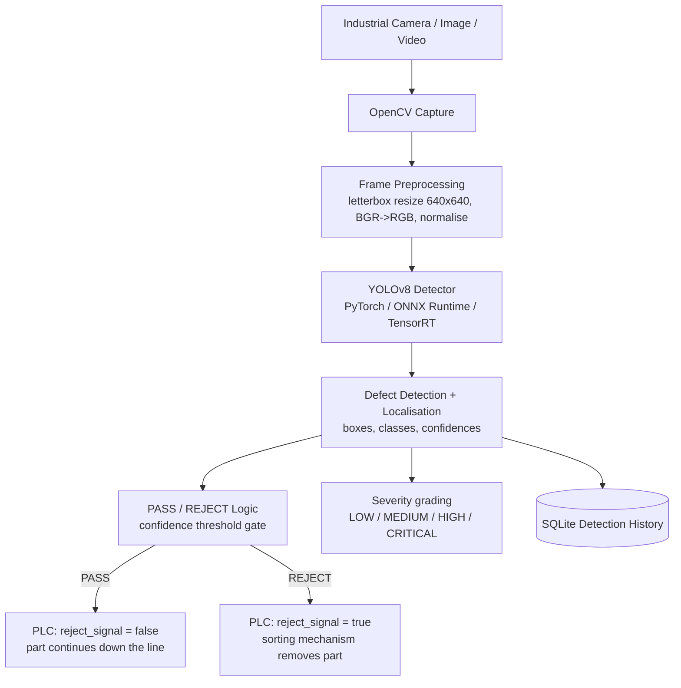
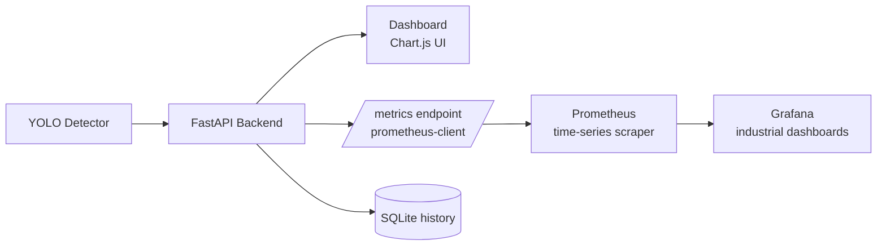
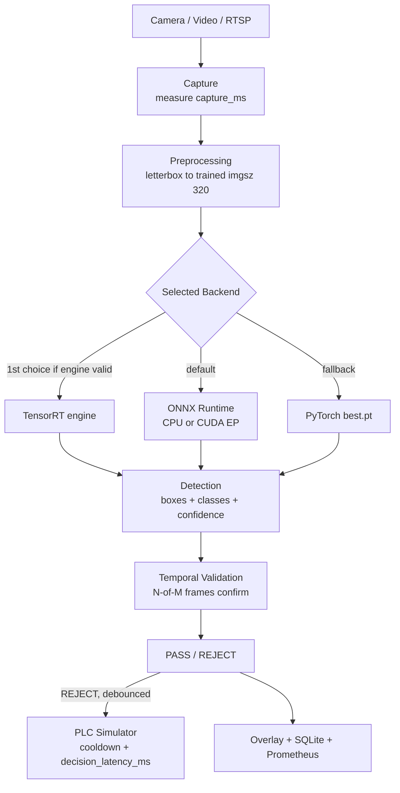

# PROJECT DOCUMENTATION
## Real-Time Industrial Defect Detection System

*Written to double as viva/exam preparation — every concept is explained in
plain language after the architecture diagrams.*

---

## 1. What the System Does

A steel plant produces rolled metal strips. This system watches the strip
(through images, video files, or a live camera), finds **six kinds of surface
defects**, draws **bounding boxes** around them, grades their **severity**,
and decides **PASS or REJECT** for every part. REJECT parts trigger a
(simulated) **PLC** signal that diverts them off the line.

Defect classes (NEU-DET):

| # | Class (dataset label) | Meaning |
|---|---|---|
| 0 | `crazing` | Networks of fine cracks on the surface |
| 1 | `inclusion` | Foreign material (e.g. slag) embedded in the steel |
| 2 | `patches` | Patch-shaped surface damage / discolouration |
| 3 | `pitted_surface` | Small holes / pits scattered on the surface |
| 4 | `rolled-in_scale` | Oxide scale pressed into the surface during rolling |
| 5 | `scratches` | Linear scratches from handling or rollers |

## 2. Main Inspection Pipeline



## 3. Monitoring Pipeline



## 4. Component Reference

| Component | File(s) | Responsibility |
|---|---|---|
| Central config | `app/config.py` | All paths via `pathlib`, thresholds, class names |
| Detector engine | `app/inference/detector.py` | Backend auto-selection (TensorRT → ONNX → PyTorch) |
| ONNX backend | `app/inference/onnx_detector.py` | ONNX Runtime session + NumPy decode + NMS |
| Preprocessing | `app/inference/preprocessing.py` | letterbox, drawing, measured `Timings` |
| Video processing | `app/inference/video_processor.py` | Frame-by-frame video inspection + annotated mp4 |
| QC logic | `app/services/qc.py` | Severity grading, PASS/REJECT decision |
| History | `app/services/detection_history.py` | SQLite event store + aggregates |
| Metrics | `app/services/metrics_service.py` | Prometheus counters/gauges/histograms |
| Camera worker | `app/services/camera_service.py` | Threaded capture loop + MJPEG publishing |
| PLC | `app/api/plc.py` | `PLCAdapter` interface, `SimulatedPLC`, Modbus skeleton |
| API | `app/api/routes.py`, `app/api/schemas.py` | REST endpoints, Pydantic schemas |
| Dashboard | `app/templates/`, `app/static/` | 9-section industrial UI |
| Training | `training/*.py` | inspect → convert → augment → train → evaluate → analyse → export |
| Tests | `tests/` | 34 pytest cases |

## 5. Concepts Explained (viva preparation)

**Object detection** — a model that answers two questions at once: *what*
objects are in the image (classification) and *where* they are (localisation
as rectangles). Detection differs from image classification, which only names
one label for the whole image.

**YOLO** — *"You Only Look Once."* The image is divided into a grid; a single
neural-network pass predicts, for every grid cell, boxes + class
probabilities simultaneously. Because everything is predicted in one forward
pass, YOLO is fast enough for real-time video — which is exactly why it suits
production-line inspection.

**Bounding box** — the rectangle (x1, y1, x2, y2) that tightly encloses a
defect. YOLO internally uses the normalised form `(center_x, center_y,
width, height)` where every value is divided by the image width/height so it
lies in **[0, 1]**. That is what our `convert_voc_to_yolo.py` produces from
the dataset's Pascal VOC `xmin/ymin/xmax/ymax` pixel values.

**Confidence** — the model's probability (0–1) that a predicted box truly
contains a defect of the claimed class. We REJECT a part only if some
detection's confidence exceeds `PASS_REJECT_THRESHOLD` (default 0.50).

**IoU (Intersection over Union)** — overlap measure between two boxes:
`area(A∩B) / area(A∪B)`. Used twice here: (1) during training, a predicted
box only "counts" for a ground-truth box if IoU ≥ 0.5; (2) during
post-processing, **NMS** (non-maximum suppression) keeps only the
highest-confidence box among heavily-overlapping duplicates.

**Precision** — of all the defects the model reported, how many were real?
`TP / (TP + FP)`. High precision = few false alarms (important: false alarms
waste good steel).

**Recall** — of all real defects, how many did the model find?
`TP / (TP + FN)`. High recall = few missed defects (important: missed defects
reach customers).

**F1 score** — harmonic mean of precision and recall; a single balanced
number: `2·P·R / (P+R)`.

**mAP (mean Average Precision)** — the standard detection metric. For one
class, the Average Precision is the area under the precision-vs-recall curve.
mAP averages AP over all six classes. **mAP@0.50** counts a match at IoU
0.5; **mAP@0.50:0.95** averages over IoU thresholds 0.50, 0.55, …, 0.95 and
is stricter.

**Data augmentation** — artificially widening the training set with random
but *physically plausible* variations (small rotations, flips, brightness /
gamma changes, slight noise and blur, CLAHE) so the model generalises to new
lighting/cameras. We deliberately avoid aggressive transforms that would
destroy defect characteristics. Bounding boxes are transformed with the
image and re-validated. Ultralytics YOLO also applies its own on-the-fly
augmentation during training.

**ONNX** — *Open Neural Network Exchange*, a vendor-neutral format for
trained models. Exporting `best.pt → best.onnx` decouples the model from
PyTorch: it can then run with **ONNX Runtime**, a lighter, faster inference
engine that installs on almost any machine — the key enabler for *edge*
deployment on factory PCs.

**TensorRT** — NVIDIA's optimised inference library. It compiles the network
into a *engine* binary tuned to the exact GPU, often several times faster
than plain PyTorch. It is optional in this project: the export script prints
`TensorRT unavailable — using ONNX Runtime/PyTorch` when NVIDIA tooling is
absent instead of failing.

**Edge computing** — running inference *on or next to the production line*
instead of shipping video to a remote server. Benefits: millisecond latency
(faster than the strip moves), no network dependency, and images never leave
the plant.

**PLC (Programmable Logic Controller)** — the rugged industrial computer
that physically drives machinery (diverter arms, air jets, conveyors). Our
software produces the same two-signal decision a real QC station would send:
`reject_signal = false` (PASS) or `true` (REJECT) plus the defect class.
We code against a `PLCAdapter` interface so a Modbus TCP / OPC UA / MQTT
implementation can replace the simulator without touching the detection
pipeline.

**Prometheus** — a monitoring server that periodically *scrapes* numeric
metrics (counters, gauges, histograms) from an application's `/metrics`
endpoint and stores them as time series. We expose: total requests, defects
by class, pass/reject totals, inference-latency histogram, camera status,
FPS and API errors.

**Grafana** — a dashboarding tool that queries Prometheus and renders
industrial-style panels (gauges, time series). Provisioned config in
`monitoring/grafana/` auto-loads our dashboard. Optional.

**PASS/REJECT logic** — the industrial decision rule:
- PASS: no detection reaches the confidence threshold → part continues.
- REJECT: at least one detection ≥ threshold → divert part.

**Severity model** — a transparent, configurable rule combining: defect
class weight (a scratch is more dangerous than light crazing), the model's
confidence, the defect's relative area, and how many defects share the part.
Documented as demonstration/business logic, not a certified standard.

## 5b. Final Model Results (Phase 3, measured)

Selected: **YOLOv8n @ imgsz 320, 60 epochs, batch 16, CUDA (GTX 1650)** —
`outputs/evaluation/experiment_comparison.csv` holds every run.

| Metric | Value |
|---|---|
| mAP@0.50 | 0.725 |
| mAP@0.50:0.95 | 0.394 |
| Precision | 0.686 |
| Recall | 0.686 |
| Confidence threshold | 0.35 (measured operating point; 0.25 = recall-priority) |

Per-class AP50 / AP50-95 and the confusion matrix live in
`outputs/evaluation/final/`. Weakest class: **crazing** (fine crack networks,
most false negatives); most false alarms: **scratches**.

**Dataset limitation:** NEU-DET contains only images with defects — there
are no normal/no-defect samples. The model is trained to localize six defect
types. PASS decisions based on absence of detection should be validated
further using normal production-surface samples before real industrial
deployment.

**Environment:** Python 3.12.6 · PyTorch 2.5.1+cu121 · Ultralytics 8.4.142 ·
CUDA 12.1 runtime on GTX 1650 (4 GB, driver 528.49) · training command:
`python training\train.py --model yolov8n.pt --epochs 60 --batch 16 --imgsz 320 --workers 0 --patience 12 --name exp_imgsz320`

## 8. Edge Deployment & Real-Time Pipeline (Phase 4)



**Backend selection** (`INFERENCE_BACKEND=auto`): candidates are tried in
priority order TensorRT → ONNX Runtime → PyTorch, and a candidate is only
selected if its model file exists, is non-empty **and actually loads** (a
warmup inference is run). A failing backend is logged and the next one takes
over — the application never crashes because one backend is broken.
`MODEL_PATH`, `ONNX_MODEL_PATH`, `TENSORRT_MODEL_PATH` env vars select files.

**Why export to ONNX?** The `.pt` file needs the full PyTorch stack (~2 GB).
Exporting to ONNX decouples the weights from the framework: ONNX Runtime is
a small, fast inference engine for CPU/GPU. On this machine it is also the
most *stable* backend (p95 ≈ median — no latency spikes) at ~62 FPS while
PyTorch-CUDA is faster in the best case (78 FPS median) but suffers VRAM
stalls when the desktop shares the 4 GB GPU. Measured table:
`outputs/evaluation/edge_benchmark.csv`.

**Edge latency vs FPS** — latency is the per-frame processing time
(capture + inference + QC + render); FPS is how many frames per second the
pipeline sustains (roughly `1000 / total_pipeline_ms`, measured with a
rolling window, never fabricated).

**Temporal smoothing (N-of-M confirmation)** — a live video can flicker a
detection on one noisy frame. The `TemporalValidator` confirms REJECT only
when a defect is present in `MIN_DEFECT_FRAMES` of the last
`TEMPORAL_WINDOW` frames (defaults 2-of-3). Disabled with window=1/min=1.

**PLC debounce** — a scratch visible for 100 frames must not send 100 REJECT
commands. `PLCDebouncer` enforces `PLC_REJECT_COOLDOWN_MS` between REJECT
dispatches; the time from confirmed decision to dispatch is measured as
`plc_decision_latency_ms` (Prometheus gauge) to demonstrate edge response.

**Model loaded once** — the `DetectionService` singleton loads the model at
startup; API requests, camera frames and dashboard refreshes reuse it.
`torch.inference_mode` is handled internally by Ultralytics predict; no
gradients are computed.

## 6. Honest-Data Guarantees (design rules baked into the code)

1. Generic COCO-pretrained YOLO weights are **never** used to claim defect
   detection; without `models/best.pt` the app shows
   `CUSTOM DEFECT MODEL NOT TRAINED` and the training command.
2. Every latency/FPS number is measured with `time.perf_counter()`.
3. Every metric on the Model Performance page comes from
   `outputs/evaluation/final/metrics.json`, produced by real Ultralytics
   validation.
4. Analytics and history show only real recorded inspections; empty state
   says "No production detection history available yet."
5. TensorRT is only claimed active if a `.engine` file actually loaded on a
   CUDA device.

## 7. Reproduction Commands (PowerShell)

### Recommended Demo Flow (viva presentation)

1. Open the dashboard (Overview loads with real KPIs even with the camera off) — explain the six defect classes.
2. **Dataset Explorer** → click *Scratches* — show real NEU images with ground-truth annotations.
3. **Image Inspection** → *Load Sample* (e.g. Patches) — original vs detected, REJECT banner, confidence + severity cards, note "Sample from NEU validation dataset".
4. **Live Inspection** → Start Camera — live boxes, FPS/latency breakdown, PASS/REJECT, PLC simulator panel (SIMULATED badge, decision latency).
5. **Analytics** — real history charts; explain empty-state honesty if no inspections yet.
6. **Model Performance** — measured mAP 72.5/39.4, per-class AP, confusion matrix, training curves, measured edge-benchmark table + recommended backend.
7. **System Health** — services, camera, CPU/RAM/GPU, uptime.
8. Show `GET /docs` (OpenAPI) and `GET /metrics` (Prometheus) — explain the monitoring pipeline.

```powershell
cd D:\NEU
.venv\Scripts\Activate.ps1

python training\inspect_dataset.py
python training\convert_voc_to_yolo.py
python training\train.py --epochs 1          # smoke test
python training\train.py --epochs 100        # full training
python training\evaluate.py
python training\error_analysis.py
python training\export_model.py

uvicorn app.main:app --reload                # dashboard + API on :8000
pytest                                       # 34 tests
python scripts\run_camera.py                 # live inspection window
docker compose up -d                         # optional monitoring stack
```
